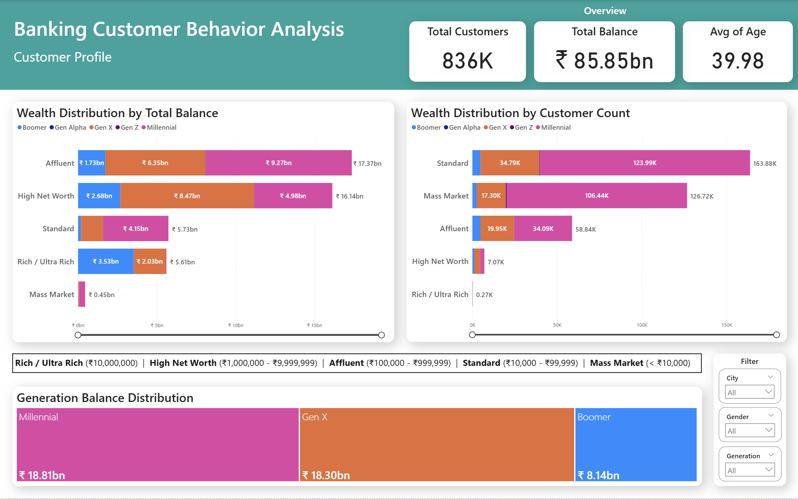
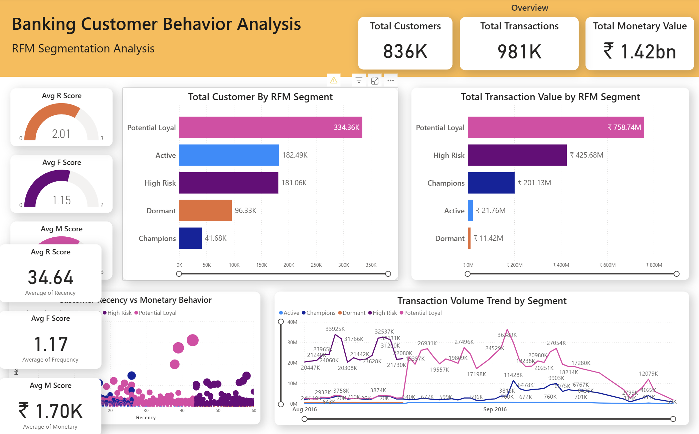
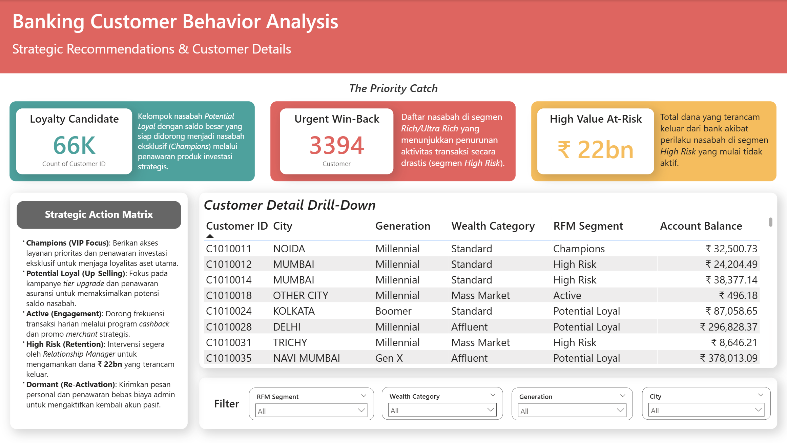

# 🏦 Banking Customer Behavior Analysis

<div align="center">


**Final Project — Data Science & Data Analyst Bootcamp · dibimbing.id**
*Oleh: Iffat Ayman Ahnaf*

</div>

---

## 📖 Latar Belakang

Sektor perbankan menghadapi tantangan besar dalam mempertahankan nasabah bernilai tinggi. Proyek ini menganalisis **1,04 juta data transaksi** dari sebuah bank di India untuk menjawab tiga pertanyaan utama:

1. Siapa profil demografis nasabah bank ini?
2. Bagaimana segmentasi perilaku nasabah berdasarkan model RFM?
3. Apa langkah strategis untuk mencegah churn nasabah bernilai tinggi?

---

## 🎯 Business Objectives

- Mengidentifikasi profil nasabah berdasarkan generasi dan tingkat kekayaan (*Wealth Category*)
- Melakukan segmentasi nasabah menggunakan model **RFM (Recency, Frequency, Monetary)**
- Merumuskan rekomendasi strategis berbasis data untuk mencegah churn

---

## 📂 Struktur Repo

```
banking-customer-behavior-analysis/
├── notebooks/
│   ├── 01_Preprocessing.ipynb        # Data cleaning & transformasi
│   └── 02_RFM_Segmentation.ipynb     # RFM scoring & segmentasi
├── assets/
│   ├── dashboard_customer_profile.png
│   ├── dashboard_rfm_segmentation_analysis.png
│   └── dashboard_strategic_recommendation.png
├── .gitignore
├── requirements.txt
└── README.md
```

---

## 📥 Dataset & Dashboard

> File CSV dan Power BI tidak disertakan di repo karena ukurannya besar.
> Unduh langsung melalui link berikut:

| Konten | Link |
|---|---|
| 📊 Dataset CSV (raw, cleaned, RFM, final) | [Google Drive — Dataset](https://drive.google.com/drive/folders/1iy-9wJps6Lxlt4EKXfNwd611UscWoj78?usp=sharing) |
| 📈 Power BI Dashboard (.pbix) | [Google Drive — Power BI](https://drive.google.com/file/d/1Uxhng8hNApXubeFkszs7nbtbEG5JAr1r/view?usp=sharing) |
| 📑 Slide Presentasi (.pdf) | [Google Drive — Presentasi](https://drive.google.com/file/d/13xwmPkbXe5TLUUxleS7yhDpqsQ9MRdYS/view?usp=sharing) |

---

## 🔧 Alur Preprocessing

| Step | Aksi | Hasil |
|---|---|---|
| 1 | Inisialisasi tipe data | 1.048.567 baris |
| 2 | Isi missing value (median/modus) | 1.048.567 baris |
| 3 | Hapus outlier tanggal lahir (< 1929 / > 2015) | 984.259 baris |
| 4 | Standardisasi nama kota → 251 kota | 984.259 baris |
| 5 | Filter periode Agustus–September 2016 | 980.856 baris |
| 6 | Agregasi per CustomerID | **835.914 nasabah unik** |

---

## 📊 Temuan Utama

### Profil Nasabah

| Metrik | Nilai |
|---|---|
| Total Nasabah | 836K |
| Total Saldo | ₹ 85,85 Miliar |
| Rata-rata Usia | 39,98 tahun |
| Total Transaksi | 980.856 |

Saldo terbesar dipegang oleh **Millennial (₹18,96 Miliar)** dan **Gen X (₹18,21 Miliar)**. Meski jumlah nasabah terbanyak ada di kelas **Standard** dan **Mass Market**, aset terbesar justru terkonsentrasi di segmen **Affluent** dan **High Net Worth** — mencerminkan Prinsip Pareto.

### Segmentasi RFM

| Segmen | Jumlah Nasabah | Total Nilai Transaksi |
|---|---|---|
| 🌱 Potential Loyal | 334.360 | ₹ 758,74 Juta |
| ⚠️ High Risk | 181.060 | ₹ 425,68 Juta |
| 💳 Active | 182.490 | ₹ 21,76 Juta |
| 🥇 Champions | 41.680 | ₹ 201,13 Juta |
| 😴 Dormant | 96.330 | ₹ 11,42 Juta |

---

## 💡 Rekomendasi Strategis

| Prioritas | Target | Aksi |
|---|---|---|
| **Loyalty Candidate** | 66K nasabah Potential Loyal (Affluent + HNW) | Kampanye tier-upgrade & produk investasi |
| **Urgent Win-Back** | 3.394 nasabah Rich/Ultra Rich di High Risk | Intervensi langsung oleh Relationship Manager |
| **High Value At-Risk** | Seluruh segmen High Risk | Amankan ₹ 22 Miliar sebelum benar-benar dormant |

---

## 📊 Preview Dashboard

### Customer Profile


### RFM Segmentation Analysis


### Strategic Recommendations


---

## 🛠️ Tech Stack

| Tools | Kegunaan |
|---|---|
| Python + Pandas + NumPy | Preprocessing & analisis data |
| Google Colab | Eksplorasi & dokumentasi |
| Microsoft Power BI | Dashboard interaktif |

---

## 🚀 Cara Menjalankan

```bash
# 1. Clone repo
git clone https://github.com/yourusername/banking-customer-behavior-analysis.git
cd banking-customer-behavior-analysis

# 2. Install dependencies
pip install -r requirements.txt

# 3. Download dataset dari Google Drive (link di atas)
# 4. Buka notebook di Google Colab secara berurutan:
#    → notebooks/01_Preprocessing.ipynb
#    → notebooks/02_RFM_Segmentation.ipynb
```

---

## 📬 Tentang Penulis

**Iffat Ayman Ahnaf** — Data Analyst in Training · dibimbing.id Bootcamp  
S1 Keuangan & Perbankan Islam · Universitas Muhammadiyah Yogyakarta  
Intern @ Bank Muamalat Indonesia · Paste Laboratory

---

<div align="center">⭐ Jika proyek ini bermanfaat, jangan lupa beri bintang! ⭐</div>
